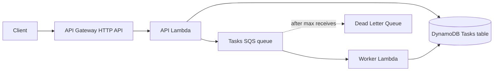
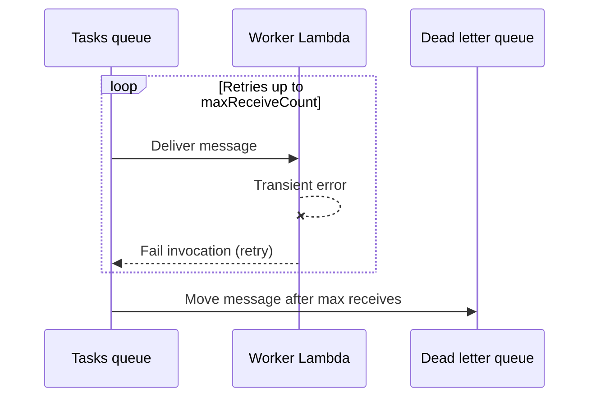
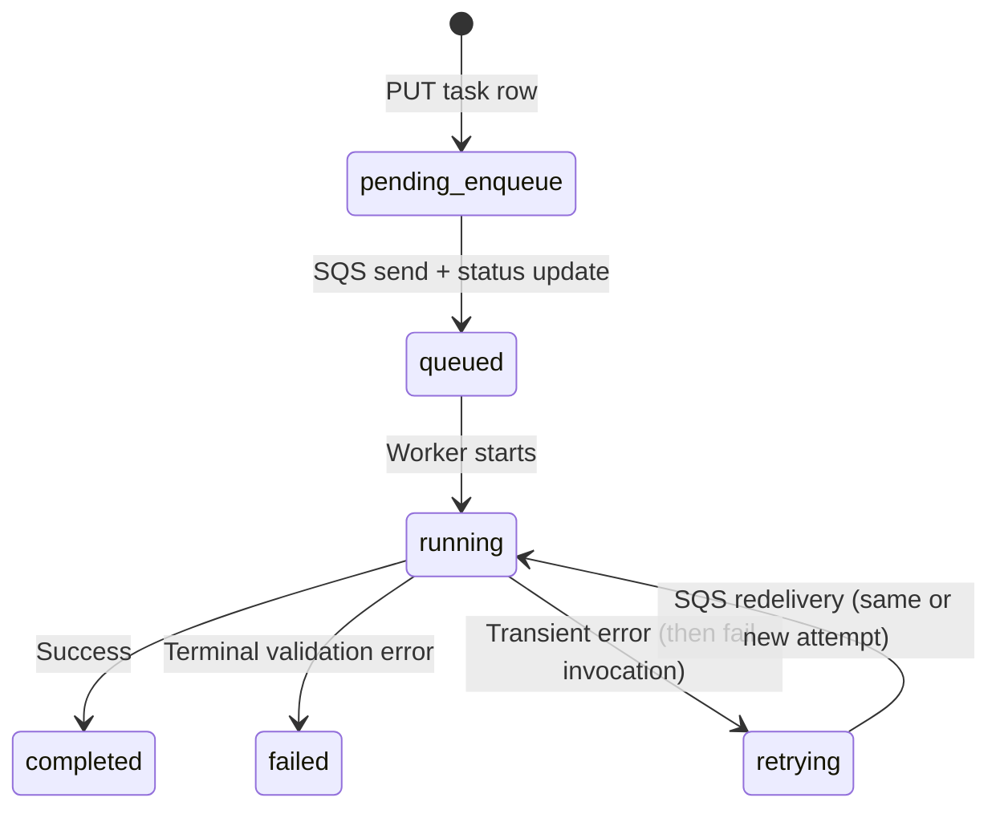

# Architecture

This document describes the current design of **aws-ai-platform-service** as implemented in code and CDK. It is meant to help new contributors and operators understand how requests flow, how task state is stored, and what is intentionally out of scope today.

## Purpose

The repository is a **production-style skeleton** for an asynchronous task API on AWS:

- HTTP API (API Gateway HTTP API) invokes a single **API Lambda** for routing and task creation.
- Long-running or background work is modeled as **messages on SQS**, processed by a **worker Lambda**.
- **DynamoDB** holds authoritative **task records** (status, input, errors).
- Failed deliveries after repeated worker failures end up in a **dead-letter queue (DLQ)** with **manual** inspection and redrive—no automatic DLQ consumer.

The goal is a clear, extensible foundation (auth, tenancy, observability, then AI workloads) without pretending the service is a full AI platform yet.

## High-level components

Supporting pieces (not shown in detail above):

- **CloudWatch alarm** on approximate visible messages in the DLQ (currently tuned for fast detection: `>= 1` visible message for 1 minute), optionally wired to **SNS** for email when `DLQ_ALERT_EMAIL` is set at deploy time.
- **Cognito User Pool + JWT authorizer** on API Gateway for `POST /tasks` and `GET /tasks/{id}`. `/health` and `/hello` are currently public.

## Request flow

### Synchronous HTTP paths

1. **Client → API Gateway → API Lambda**  
   API Gateway invokes the API Lambda with an HTTP API v2–style event (`requestContext.http.path`, `requestContext.http.method`).

2. **Routing**  
   The Lambda handler dispatches on path and method (`src/service/api_handler.py`): `/health`, `/hello`, `POST /tasks`, `GET /tasks/{id}`.

3. **Task creation (`POST /tasks`)**  
   - Validates JSON body (`job_type`, `input` required).  
   - Writes a new item to DynamoDB, then sends a JSON message to the tasks queue, then updates status to **queued** (see [Task state](#task-state-transitions)).  
   - Returns **202 Accepted** with the task payload including current status.

4. **Task read (`GET /tasks/{id}`)**  
   Reads the item by `task_id` from DynamoDB and returns it, or **404** if missing.

Task routes now require JWT authentication at API Gateway. API handlers also enforce tenant ownership by reading JWT claims (`custom:tenant_id` for tenant scope and `sub`/`email` for creator identity).

### Async worker path

1. **SQS → Worker Lambda**  
   The worker is triggered by the tasks queue (`SqsEventSource`, batch size 1).

2. **Processing**  
   The worker parses `task_id` from the message body, sets status to **running**, performs work (today a simulated delay), then sets **completed** on success.

3. **Failures**  
   - **Validation / bad message** (`ValueError`): task is marked **failed** with an error message; the invocation does not rethrow, so SQS treats the message as successfully processed and deletes it.  
   - **Other exceptions**: task is marked **retrying** with an error snippet, then the exception is **re-raised** so the Lambda fails the batch item and SQS can retry. After **maxReceiveCount** (5 in CDK), the message moves to the **DLQ**.

### DLQ path

There is **no** Lambda or other automation that consumes the DLQ. Operators use the console, APIs, or the repo script (`scripts/dlq_redrive.py`) to inspect, redrive, or purge. See [DLQ and alerts runbook](runbooks/dlq-and-alerts.md) and ADR [0002](adrs/0002-dlq-manual-operation.md).

## Task state transitions

Statuses are stored in DynamoDB on the task item (`status` field). The API and worker code in this repo use the following values.

| Status | When it is set |
|--------|----------------|
| `pending_enqueue` | Immediately when the task row is first written (before SQS send succeeds). |
| `queued` | After the message has been sent to SQS and the create path has updated DynamoDB. |
| `running` | Worker has started processing the message. |
| `completed` | Worker finished successfully. |
| `failed` | Worker determined the message is invalid or terminally bad (`ValueError` path). |
| `retrying` | Worker hit a non-terminal error, updated DynamoDB, then rethrew so SQS can retry. |

**Important:** After enough failed attempts, SQS moves the message to the **DLQ**, but DynamoDB may still show **`retrying`** until an operator updates the record or a redrive succeeds. That split between **queue truth** and **stored status** is intentional for this phase; see Week 2 documentation and ADRs for operational semantics.

The sprint roadmap used names like `pending`; in code, the pre-queue state is **`pending_enqueue`** to distinguish it from **`queued`**.

## Current intentional limitations

- **Tenant migration caveat:** Older task rows created before tenant-aware writes may not have `tenant_id`; those records may be inaccessible under strict tenant checks until migrated.
- **No automatic DLQ processing:** Poison or stuck messages require manual or scripted handling.
- **Worker is a stub:** Processing is a sleep; there is no real AI or external integration yet.
- **Single table, string PK:** `task_id` only; no GSIs for listing by user or tenant.
- **Alert noise tradeoff:** DLQ alarm is tuned to page quickly (including single-message incidents), which can be noisier than backlog-only alerting; see the runbook.

These limits are acceptable for a **foundation** milestone; tightening them is tracked in the product roadmap (auth, observability, then AI layer).

## Scale, redundancy, and concurrency (current posture)

This service is **single-region** and relies on **managed** API Gateway, Lambda, SQS, and DynamoDB—those already provide multi-AZ durability within the region. The main **operational** redundancy story for poison paths is **DLQ + manual redrive**, not a second hot stack.

**Concurrency:** SQS can drive **many parallel worker invocations**; practical limits include **Lambda account/region concurrency**, **worker duration** vs queue **visibility timeout**, and **DynamoDB** throughput or hot keys. **Provisioned concurrency** (warm Lambdas) is optional and usually deferred until **latency metrics or SLOs** justify the cost.

**Documentation-only extensions** (idempotency, caching, DynamoDB TTL/S3 results, LocalStack, GSIs for list-by-tenant) live in **[implementation-plan.md](implementation-plan.md)** so the architecture doc stays tied to what is implemented *today*.

## Related documents

- [README](../README.md) — overview, endpoints, deploy, roadmap summary
- [Implementation plan (living)](implementation-plan.md) — sprint checklist, priorities, extended topics from discussion
- [ADR 0001: Async task pattern](adrs/0001-async-task-pattern.md)
- [ADR 0002: DLQ manual operation](adrs/0002-dlq-manual-operation.md)
- [ADR 0003: Auth and tenancy](adrs/0003-auth-and-tenancy.md)
- [DLQ and alerts runbook](runbooks/dlq-and-alerts.md)
